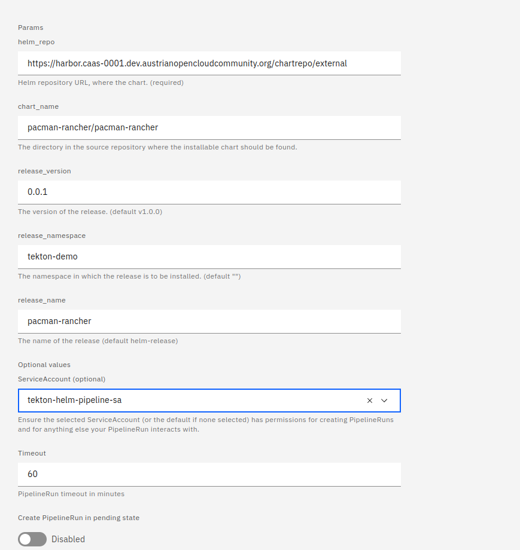

# [helm-upgrade-from-repo](https://hub.tekton.dev/tekton/task/helm-upgrade-from-repo)
These tasks will install / upgrade a helm chart into your Kubernetes giving only a helm repo URL.


## install task
```bash
kubectl apply -f https://api.hub.tekton.dev/v1/resource/tekton/task/helm-upgrade-from-repo/0.2/raw
```

## apply pipeline
```bash
kubectl apply -f helm-upgrade-from-repo/helm-upgrade-from-repo-pipeline.yaml -n NAMESPACE
```

### pipeline params
Used in the [tekton-dashboard](http://tekton-dashboard:9097/) 

```yaml
helm_repo: https://austriandatalab.github.io/onetimesecret/
chart_name: ots/ots
release_version: 0.0.5
release_name: ots
release_namespace: tekton
```




# TODO
* see [yq](https://hub.tekton.dev/tekton/task/yq) task
